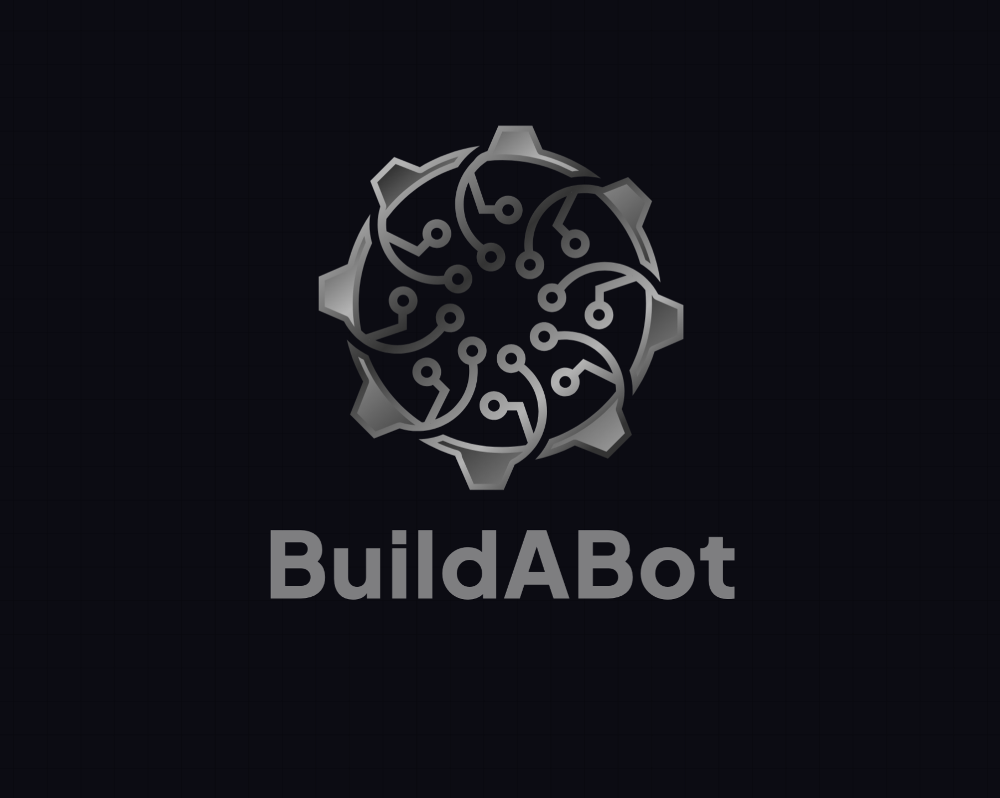

<p align="center">
  
</p>

<h1 align="center">BuildABot</h1>

<p align="center">A no-code platform for building and deploying custom AI chatbots using visual workflows.</p>

---

## About

BuildABot lets you create intelligent chatbots without writing code. Using a visual workflow builder, you can design multi-turn conversation flows, connect to external APIs, embed knowledge bases, and deploy your bot across channels like WhatsApp.

### Screenshots

<p align="center">
  
</p>

Key capabilities:
- **Visual workflow builder** — design branching conversation flows with a drag-and-drop interface
- **Intent detection** — LLM-powered routing that maps user messages to the right workflow step
- **Knowledge bases** — upload documents and let the bot answer questions using vector search
- **API integrations** — call external HTTP endpoints directly from a workflow step
- **WhatsApp integration** — connect your bot to Meta's WhatsApp Business API
- **Session management** — maintain context across multi-turn conversations

## Tech Stack

| Layer | Technology |
|---|---|
| Frontend | React 19, TypeScript, Vite, Mantine UI |
| Backend | Go, Gorilla Mux, GORM |
| Database | PostgreSQL + pgvector |
| AI | OpenAI API (LLM + embeddings) |
| Storage | AWS S3 |
| Messaging | Meta WhatsApp API |

## Running Locally

### Prerequisites

- Go 1.25+
- Node.js + pnpm
- PostgreSQL with the `pgvector` extension enabled

### 1. Configure environment variables

Create a `.env` file in the `backend/` directory:

```env
DB_HOST=localhost
DB_PORT=5432
DB_USER=postgres
DB_PASSWORD=your_password
DB_NAME=buildabot

JWT_SECRET=your_jwt_secret

OPENAI_API_KEY=your_openai_key

S3_BUCKET=your_bucket
S3_REGION=us-east-1
AWS_ACCESS_KEY=your_key
AWS_SECRET_KEY=your_secret
```

Create a `.env` file in the `frontend/` directory:

```env
VITE_API_URL=http://localhost:8080/api/v1
```

### 2. Start the development servers

```bash
./dev.sh
```

This starts both servers concurrently:
- **Backend** — `http://localhost:8080`
- **Frontend** — `http://localhost:5173`
- **API docs (Swagger)** — `http://localhost:8080/swagger/index.html`

### Frontend only

```bash
cd frontend
pnpm install
pnpm run dev
```

### Backend only

```bash
cd backend
go run main.go
```

## License

This project is licensed under the [MIT License](LICENSE).
